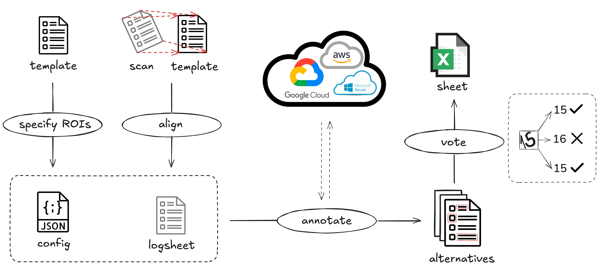

# Summary

`formHTR` is a Python software package for automatic extraction of handwritten contents from scanned form documents. While the content extraction itself is accomplished using advanced pretrained OCR models, a key step in the process is considering the prior knowledge of the expected contents. That is achieved by the precise, semi-automatic annotation of the regions of interest (ROIs) in the form template, specifying the locations and content types of ROIs. Using this approach in combination with comparing and evaluating outputs from multiple OCR models significantly improves the quality of the extraction.

# Statement of need

Large-scale scientific expeditions often collect huge amounts of samples, with a need to record the origin and context of the samples and observed features (metadata). While digital metadata collection methods are becoming more popular, paper forms (so called *logsheets*) are still the most popular method for their reliability in extreme environments, stability, natural scalability, and ease to use [@VANTAMELEN2004123; @BREWER2016131].

It is necessary to build an infrastructure for processing of the logsheets automatically with a minimal amount of manual interventions and laborious proofreading. Optical character recognition (OCR) methods [@ocr156468] are used to extract the content from a scanned logsheet, with additional complexity added by handwritten type of content. While training custom models on a particular handwriting style of a person is generally more precise, this approach is infeasible for large-scale expeditions with high turnaround of staff and consequently higher amount of distinct handwritings. The use of multiple pretrained general purpose OCR models, allowing consensus or majority decision making, is a more suitable approach.

Additionally, assuming a large-scale expedition enforces certain standards on the sample collection process, so does it on the metadata level. That means standardised logsheets are often developed, and used repeatedly in various sampling scenarios. As a consequence, to digitalise the contents of such logsheets, we can leverage their known structure and expected content types to navigate the OCR methods for more reliable and precise results.

# State of the field

The current OCR landscape of pretrained tools can be split between open-source models and cloud-based services. On the open-source side, there are many tools such as Tesseract OCR [@tesseract_ocr], EasyOCR [@easyocr], OCR4All [@app9224853], and PaddleOCR [@cui2025paddleocr30technicalreport] which provide pretrained models or optionally allow to train custom models. Some of the trade-offs are in accuracy, speed, and deployment complexity. Cloud-based pretrained OCR services, including Google Cloud Vision API [@google_vision_api], Azure AI Document Intelligence [@azure_form_recognizer], and Amazon Textract [@amazon_textract], are accessible via APIs and are highly optimised for structured documents and provide higher-level outputs (e.g. key–value pairs).

A natural extension are tools that combine multiple tools, models, or services. Systems such as OCRmyPDF [@ocrmypdf] or unified interfaces like OcrPy [@ocrpy] integrate engines like Tesseract, cloud APIs, and downstream processing into a single pipeline, effectively abstracting over multiple OCR backends. The tool `Handprint` [@handprint] combines multiple cloud services and outputs annotated images or raw results, as well as compares the recognized text to some level of the ground truth (expected content)[^1].

[^1]: The package is not maintained anymore.

# Software design

The tool is structured into two main steps with an overview in \autoref{fig:overview}. The specification step is dedicated to annotating form templates in order to specify the regions of interest (ROIs) and assign them a meaning. This is achieved by selecting and manipulating the region locations, while the variable names and ROI types are assigned to individual ROIs. The output of the specification step is a config file containing position, name, and type of identified ROIs.



The next step identifies and extracts content from the ROIs. First, the scanned logsheet and its template are aligned to ensure the ROIs actually match the regions in the scanned logsheet (otherwise they would point to potentially empty or generally mismatched regions). While the goal is straightforward, the execution can be problematic, especially when the template has no fiducial markers or the scan quality is low. For this reason, a manual alignment is possible as well.

The aligned logsheet is converted to an image and several OCR models are queried to identify and extract the content. For this purpose, three services are used by calling their respective APIs - Google Cloud Vision [@google_vision_api], Azure AI Document Intelligence [@azure_form_recognizer], and Amazon Textract [@amazon_textract]. All three services output a set of detected words with their location (bounding box) in the image.[^2]

[^2]: All services offer a free tier with limited amount of requests per month. The user needs to provide suitable account credentials. A quick start description how to do this is available at the [wiki pages](https://github.com/grp-bork/formHTR/wiki/Setup-services) of the `formHTR` repository.

After collecting the identified contents for each service, the process of binning assigns each captured text fragment (word) to the appropriate ROI. Several cases need to be considered, such as a word spanning over multiple ROIs, multiple words overlapping with a single ROI, or a sentence split into several words (for examples, see \autoref{fig:binning}). To find all overlaps for a ROI from all the services, we use `R-tree` [@rtree] to index the regions and capture their overlaps for all services' outputs and the template specification, and consequently use it to effectively query for intersections. Additionally, the logsheet can contain preprinted contents (*residuals*) that do not belong to ROIs, but can be shifted to its boundary box by an imperfect alignment. This is handled by defining the residuals already in the specification step, thus allowing to exclude them from the outputs.


Assuming the words are binned for all services, we can use a voting algorithm to pick the most likely output. With three services, a majority vote can be applied. In cases when there is no consensus, a random choice is made. Similarly, the tool works even with less than three services enabled, albeit with lower output quality due to the inability to perform the voting. On top of the voting, the weight of votes can be altered by using the known information about the ROIs. In the current version, priority is given to numerical values (if expected). This aspect has a very high potential for extensions in the future versions (e.g. allow only values from a dictionary, only content satisfying a regex, only numbers from an integer range, or content satisfying a length threshold).

The output of `formHTR` is an Excel spreadsheet (an `.xlsx` file) with two sheets. `Metadata` sheet has three columns - a variable name coming from the specification, the extracted content as the result of the voting algorithm, and a picture cut out of the scanned (and aligned) logsheet based on the bounding box defined in the specification. This can be used for a quick proofreading of the outputs. `Extra` sheet contains any miscellaneous content that neither falls into any ROI nor was filtered out as a residual. This can typically alert the user to any comments and notes written on unexpected parts of the logsheet.

# Research impact statement

`formHTR` was used on a set of scanned logsheets containing provenance metadata coming from the TRaversing European Coastlines (TREC) expedition[^3]. Roughly ten thousand double-sided logsheets of roughly hundred different types (templates) were collected, together providing contextual metadata to more than eighty thousand collected samples. Using `formHTR`, the logsheet templates were annotated and all the scanned logsheets processed. The metadata was extracted and curated, and archived[^4] in the BioSamples database [@courtot2022biosamples]. The contextual metadata is an essential foundation for sample analysis and data production, which, at the time of writing is in the initial phase.

[^3]: https://www.embl.org/about/info/trec/

[^4]: https://www.ebi.ac.uk/biosamples/samples?text=Traversing+European+Coastlines+%28TREC%29+expedition

# Example workflow

An example workflow where we first create and annotate ROIs for the template, and consequently process the scanned logsheet, ultimately creating the output Excel spreadsheet.

```
# 1) Create ROI config for a template
formhtr select-rois --pdf-file template.pdf --output-file config.json

# 2) Annotate ROI types and variable names
formhtr annotate-rois --pdf-file template.pdf --config-file config.json --output-file config_annotated.json

# 3) Process a scanned logsheet
formhtr process-logsheet \
  --pdf-logsheet scan.pdf \
  --pdf-template template.pdf \
  --config-file config_annotated.json \
  --output-file output.xlsx \
  --google google_credentials.json \
  --amazon amazon_credentials.json \
  --azure azure_credentials.json
```

# Author's Contributions

MT wrote the manuscript and developed the software. JG contributed to the software. SP contributed via conceptual guidance and contributed to the manuscript. PB provided conceptual oversight and funding.

# AI usage disclosure

No generative AI tools were used in the development of this software, or the writing of this manuscript. AI tools were used in the preparation of supporting materials, namely setting up and generating the documentation and tests.

# Acknowledgements

This publication was enabled by the support of EMBL member states to the TREC expedition, within the framework of EMBL’s Molecules to Ecosystems Programme (2022-2026).

# References
